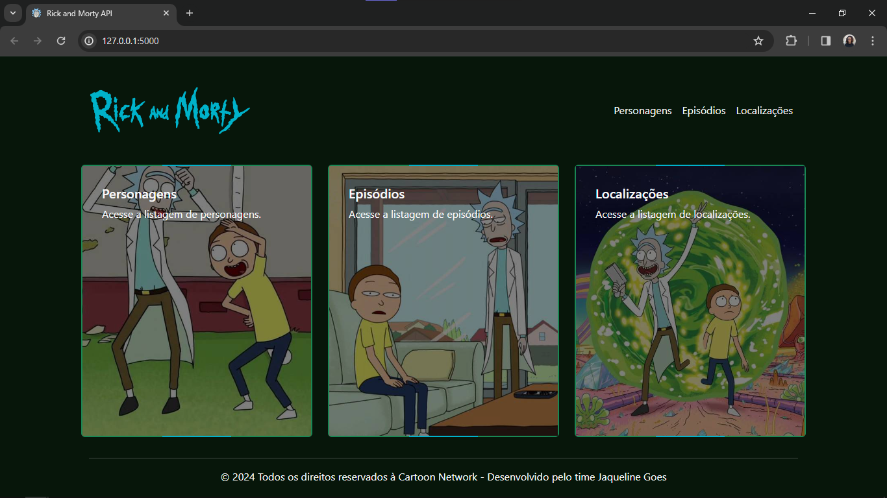

# Desafio API | Rick and Morty API

Este código é a solução do desafio do módulo de APIs do Bootcamp Python e Django promovido pela [Womakers Code](https://womakerscode.org/). O desafio consiste em criar uma aplicação WEB que consume a [Rick and Morty API](https://rickandmortyapi.com/).

## 🖼 Pré-visualização



## 📑 Endpoints

`/`: exibe a página inicial.

`/locations`: exibe uma listas de localizações.

`/location/:id`: exibe detalhes sobre uma localização específica.

`/episodes`: retorna uma lista com todos os episódios.

`/episode/:id`: detalha o episódio correspondente ao id.

`/character`: lista todos os personagens.

`/character/:id`: mostra os detalhes de um personagem.

## 👩🏼‍💻 Como testar

0. Clone o repositório na sua máquina.

    ```
    git clone https://github.com/debora-evilaine/DesafioAPI_SquadJaquelineGoes
    ```


Com o terminal aberto no diretório raiz da aplicação:

1. Crie o virtual environment através do comando:

    ```
    python -m venv .venv_desafio_rickymorty
    ```

2. Ative o .venv utilizando:

    ```bash
    .\venv\Scripts\activate # Para windows
    ```

    ou
    
    ```bash
    source <venv>/bin/activate # Para linux
    ```

3. Instale os pacotes necessários para rodar a plicação:

    ```bash
    pip install -r requirements.txt
    ```

4. Agora execute a aplicação:
    ```bash
    flask --app app run
    ```

5. Abra seu navegador e acesse o caminho [`http://127.0.0.1:5000`](http://127.0.0.1:5000)

## 👥 Como desenvolvemos o desafio

As integrantes do Squad Jaqueline Goes se reuniram em uma chamada no Google Meet, em que escrevemos o código ao vivo, todas participando, dando sugestões e tirando dúvidas. Depois disso, cada uma foi fazendo suas contribuições no repositório afim de versioná-las.

## Integrantes:
#### [Adrielly Ribeiro](https://github.com/Eidryel2)
#### [Nayara Aguiar Silva](https://github.com/devnayarasilva)
#### [Mariana Lemos Muller](https://github.com/MariMueller)
#### [Beatriz Mendes da Silva](https://github.com/falakbea)
#### [Débora Evilaine Sousa Moreira](https://github.com/debora-evilaine)
#### [Vanilza F. Silvestre](https://github.com/Vaflosima)
#### [Emanuelle Cruz](https://github.com/manuscruz)
#### [Lívia Raiane do Nascimento](https://github.com/livnascimento)
#### [Lucia Ribeiro Durães](https://github.com/luhduraes)
#### [Marcia Pinto Barcelo](https://github.com/Mpbarcelo)
#### [Izadora Sobral](https://github.com/izadorasobral)


## 🔗 Links úteis

- [Documentação do Python](https://docs.python.org/3/)
- [Documentação do Flask](https://flask.palletsprojects.com/en/3.0.x/)

---

💜 Obrigada por visitar nosso repositório!
